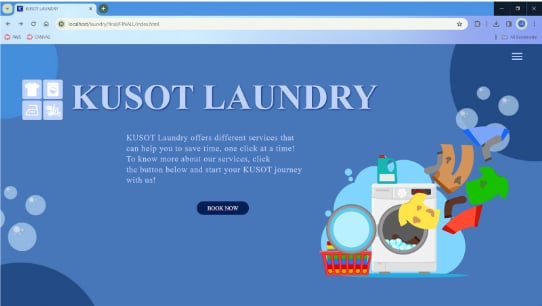
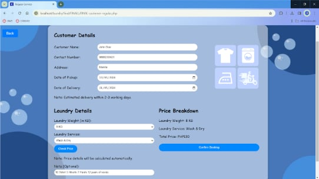

# 🧺 Kusot Laundry Website Management System  

## 👥 Group Members
- Sean Ray Bongansiso 
- Aizen Johann Calilan
- Jyke Jenfrey Gapasin 
- Ivan Crisruf Malitao
- Lyka Mariel Villafolres

---

## 🎯 Project Aim  
The **Kusot Laundry Website** aims to modernize laundry shop operations by offering customers a simple online booking system and providing owners/managers with a streamlined revenue tracking and reporting tool.  

By using **HTML**, **CSS**, **JavaScript**, **PHP**, and **SQL**, the platform connects customers and shop owners in one place — making laundry service scheduling, order tracking, and revenue monitoring more efficient and user-friendly.  

---

## ⚙️ Usage & Features  

### 👤 Customer Features  
- 📅 **Booking System** – Schedule laundry services online.  
- 🧼 **Service Selection** – Choose from various laundry services.  
- 📝 **Order Management** – Place, view, and delete orders.  
- 📜 **Order History** – Track past orders.  

### 🏢 Owner/Manager Features  
- 📊 **Revenue Summary** – View total daily income.  
- 📂 **Database Access** – Monitor customer and order details.  
- 🖥 **Admin Panel** – Oversee system activity and records.  

### 🔒 Limitations (Current Version)  
- 🚫 No map/location-based search for nearby laundry shops.  
- 🚫 No chat or live customer service integration.  
- 🚫 Profile editing restrictions after sign-up.  
- 🚫 No predefined clothing checklist — only optional notes.  

---

## 🖼 Visual Demonstrations  

**Homepage & Login Screen 🔑**  
  

**Booking Form 📅**  
  

**Admin Revenue Dashboard 📈**  
  

---

## 📚 Tech Stack  
**Frontend:** HTML, CSS, JavaScript  
**Backend:** PHP  
**Database:** SQL  

---

## 🚀 Current Development Status  

The initial KUSOTPH version was developed using foundational web skills (HTML, CSS, JavaScript). We are currently working on updates to implement modern features and frameworks for improved performance, security, and user experience. Future versions will include enhanced UI/UX, API integrations, better database handling, and mobile responsiveness to meet current digital standards. 🚀

